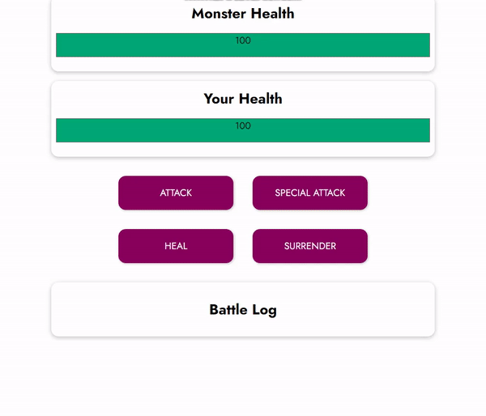

# Vue Slay Monster Game

- Basic text-based battle game created using Vue.

## Features

- Attack, heal, special attack and surrender. (Values are created randomly)
- If monster's or player's live is under 0 the game finishes.
- Battle logs are logged after each move.
  

- This project is originally from [Maximilian Schwarzmüller's course](https://www.udemy.com/course/vuejs-2-the-complete-guide/)
